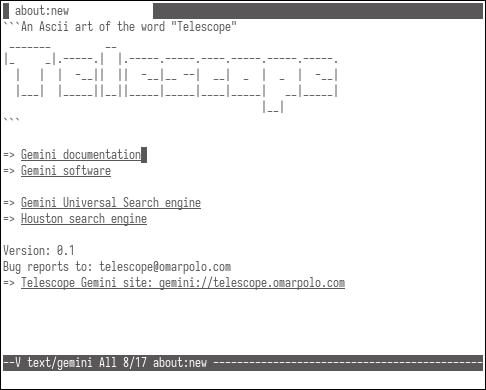

```
 _______         __
|_     _|.-----.|  |.-----.-----.----.-----.-----.-----.
  |   |  |  -__||  ||  -__|__ --|  __|  _  |  _  |  -__|
  |___|  |_____||__||_____|_____|____|_____|   __|_____|
                                           |__|
```

Telescope is a w3m-like browser for Gemini.  It was written on a whim,
just to play with ncurses, libtls, libevent and the macros from
`sys/queue.h`, but I'd like to finish it into a featureful Gemini
browser.

At the moment, telescope is something **a bit more than a working
demo**.  However, it has already some interesting features, like
streaming pages, tabs, privsep, input from the minibuffer etc...

There are still various things missing or, if you prefer, various
things that you can help develop :)

 - UTF8 handling: it needs to handle non-ASCII characters in pages and
   in the minibuffer input
 - bookmarks
 - subscriptions
 - tofu
 - client certificates
 - add other GUIs: atm it uses only ncurses, but telescope shouldn't
   be restricted to TTYs only!
 - configuration file: even proposals are accepted.  It needs a way to
   define keybindings, colors etc in a way that will possibly work on
   more than one graphic libraries.




## Building

Telescope depends on ncursesw, libtls (from either LibreSSL or
libretls), libevent (either v1 or v2).

To build from a release tarball just execute:

	./configure
	make
	sudo make install

If you want to build from the git checkout, something that's
discouraged for users who don't intend to hack on telescope

	./autogen.sh
	./configure
	make
	sudo make install	# eventually

Please keep in mind that the main branch, from time to time, may be
accidentally broken on some platforms.  Telescope is developed
primarily on OpenBSD/amd64 and commits on the main branch don't get
always tested in other OSes.  Before tagging a release however, a
comprehensive testing on various platform is done to ensure everything
is working as intended.


## License

Telescope is distributed under a BSD-style licence.  The main code is
under the ISC but some files under `compat/` are BSD2 or BSD3.
